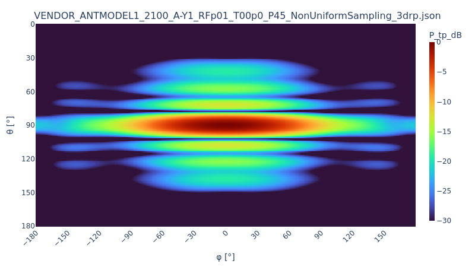

# eas-3d-pattern

[](https://pypi.org/project/eas-3d-pattern/)
[](https://pypi.org/project/eas-3d-pattern/)
[](https://github.com/Ericsson/eas-3d-pattern/blob/main/LICENSE)
[](https://github.com/Ericsson/eas-3d-pattern/actions/workflows/ci.yml)
[](https://github.com/astral-sh/ruff)

A Python library for **visualizing** and computing **beam efficiency** on **3D antenna radiation patterns** conforming to the [NGMN BASTA](https://www.ngmn.org/workprogramme/basta.html) JSON schema.

---

## What is this?

Given a 3D radiation pattern in JSON format which follows the NGMN BASTA (Base Station Antenna Standards) specification, with this library you can:

- **Parse** the BASTA-compliant JSON, handles multiple coordinate systems and sampling formats automatically
- **Calculate** beam efficiency across configurable sectors (EAS methodology)
- **Visualize** patterns as 2D heatmaps and 3D polar plots

## Installation

```bash
pip install eas-3d-pattern
```

<details>
<summary><strong>Development installation</strong></summary>

```bash
git clone https://github.com/Ericsson/eas-3d-pattern.git
cd eas-3d-pattern
poetry install
```

Run tests:

```bash
poetry run pytest
```

Lint and format:

```bash
poetry run ruff check .
poetry run ruff format .
```

</details>

## Quick Start

```python
from eas_3d_pattern import AntennaPattern, SAMPLE_JSON

# Load a 3D radiation pattern from JSON
pattern = AntennaPattern(SAMPLE_JSON[0])

# Inspect antenna parameters
print(f"{pattern.antenna_model} @ {pattern.frequency_hz / 1e6:.0f} MHz — {pattern.gain_dbi:.1f} dBi")
# → ANTMODEL1 @ 2100 MHz — 18.3 dBi

# Calculate beam efficiency (EAS default sectors)
efficiency = pattern.calculate_beam_efficiency()
print(f"Cell sector: {efficiency['Cell'] * 100:.1f}%")
# → Cell sector: 72.4%

# Visualize the normalized power pattern
pattern.plot()
```

<p align="center">
  
</p>

## Features

| Feature | Description |
|---------|-------------|
| **Multi-format parsing** | Accepts uniform and non-uniform sampling, all NGMN coordinate systems (SPCS_Polar, SPCS_CW, SPCS_CCW, SPCS_Geo) |
| **Schema validation** | Optional validation against the official NGMN BASTA JSON Schema |
| **Beam efficiency** | Compute power distribution across predefined EAS sectors or custom rectangular regions |
| **Custom sectors** | Define your own analysis regions with arbitrary θ/φ boundaries |
| **Directivity & losses** | Calculate directivity and estimate ohmic losses from declared gain |
| **Visualization** | Interactive heatmaps and 3D polar plots |
| **Batch reporting** | Process a directory of JSON files into a structured Excel report with optional PNG exports |

## Examples

See the [example notebooks](https://github.com/Ericsson/eas-3d-pattern/tree/main/notebooks) for detailed walkthroughs.

## Resources

- [NGMN BASTA specification](https://www.ngmn.org/workprogramme/basta.html)
- [NGMN BASTA JSON Schema](https://www.ngmn.org/schema/basta/NGMN_BASTA_AA_3drp_JSON_Schema_WP3_0_latest.json)
- [Example BASTA JSON files](https://www.ngmn.org/schema/basta/)

## Contributing

Contributions are welcome! Please see [CONTRIBUTING.md](CONTRIBUTING.md) for guidelines.
